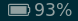
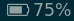
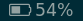
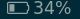
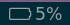

# battery

Pretty simple python script that shows battery info.
# Appearance








# Dependencies

* `python3.7`
* `psutil`
* `Font Awesome`

# Config

```
[battery]
command=$SCRIPT_DIR/battery.py
interval=30
```
